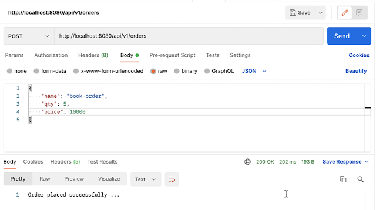

In the above architecture, OrderService, StockService, and EmailService microservices are independent of each other. OrderService is a Producer application that sends an event to the Message Broker. StockService and EmailService are Consumers who will consume the events from the Message Broker.

In this tutorial, we will also see how multiple consumers will subscribe to a single Kafka topic to consume the events/messages.

1. Download Kafka from the official website at https://kafka.apache.org/downloads

2. Extract Kafka zip in the local file system
   Run the following commands in order to start all services in the correct order:

3. Start Zookeeper service.

Use the below command to start the Zookeeper service:
# Start the ZooKeeper service
# Note: Soon, ZooKeeper will no longer be required by Apache Kafka.
$ bin/zookeeper-server-start.sh config/zookeeper.properties
4. Start Kafka Broker

Open another terminal session and run the below command to start the Kafka broker:
# Start the Kafka broker service
$ bin/kafka-server-start.sh config/server.properties
Once all services have successfully launched, you will have a basic Kafka environment running and ready to use.
Create 4 Microservices - OrderService, StockService, EmailService, and Base-Domains

#Order Service
1. Create Order and OrderEvent DTO Classes in Base-Domains

   Open base-domains microservice and quickly create Order and OrderEvent DTO classes.
-- Order, OrderEvent DTO
2. Configure Kafka Producer in an OrderService Microservice

   Open the application.properties file of the order-service project and configure Kafka producer.
3. Configure Kafka Topic in OrderService Microservice

   In an order-service project, create a config package. Within the config package, create a class named KafkaTopicConfig and add the following configuration to create the Kafka topic.
4. Create Kafka Producer in OrderService Microservice

   In an order-service project, create a package named kafka. Within a kafka package, create a class named OrderProducer

--OrderProducer
Note that we are sending an OrderEvent object to a Kafka Topic.

We created a KafkaTemplate<String, OrderEvent> since we are sending Java Objects to the Kafka topic that’ll automatically be transformed into a JSON byte[].

In this example, we created a Message using the MessageBuilder. It’s important to add the topic to which we are going to send the message too.

#StockService
5. Create REST API to Send Order and Test Kafka Producer in OrderService Microservice

   Let's create a simple POST REST API to send Order information as a JSON object.

In an order-service project, create a package named controller. Within a controller package, create a class named OrderController

6. Configure Kafka Consumer in StockService Microservice

   Open the application.properties file of the stock-service project and configure Kafka consumer.

7. Create Kafka Consumer in StockService Microservice

   Let's create a Kafka Consumer to receive JSON messages from the topic.

In a stock-service project, create a package named kafka. Within a kafka package, create a class named OrderConsumer

--OrderConsumer
Note that we are using @KafkaListener annotation to receive messages/events from the Kafka topic.

8. Configure and Create Kafka Consumer in EmailService Microservice

   Open the application.properties file of the email-service project and configure Kafka consumer.

#EmailService

9. Let's create a Kafka Consumer to receive JSON messages from the topic.

In a email-service project, create a package named kafka. Within a kafka package, create a class named OrderConsumer

10. Run 3 Microservices Together and Have a Demo

    Let's run all the below 3 Spring boot microservices projects:

    ->order-service

    ->stock-service

    ->email-service

Next, verify the logs in the console for all the 3 microservices.
